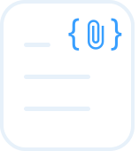

# Automata



L'idea alla base di Automata nasce dal desiderio di creare uno strumento che potesse aiutare gli studenti nello studio, permettendo loro di caricare riassunti e documenti su una piattaforma e interrogare un modello di Intelligenza Artificiale in grado di fornire risposte mirate e specializzate. 

Il progetto si è evoluto dall'idea iniziale fino a diventare un sistema completo basato su Retrieval-Augmented Generation (RAG), combinando la potenza della ricerca vettoriale con la generazione di testo basata su LLM.

Oltre all'utilità pratica, lo sviluppo di Automata è stato un'opportunità per esplorare il mondo dell'AI generativa, dei sistemi basati su RAG e della gestione avanzata delle informazioni attraverso modelli pre-addestrati e database vettoriali.

## Tecnologie Utilizzate ##
- **Backend**: FastAPI e LangChain
- **Frontend**: React + Bootstrap
- **Database**: PostgreSQL standard ed estensione PG Vector Store
- **AI**: Ollama con supporto GPU per modelli LLM
- **Containerizzazione**: Docker 

---

## Installazione progetto ##

Per l'installazione del progetto è richiesto Docker.

Tramite il comando ``` docker compose up ```, verranno orchestrati i tre container principali del progetto Automata:

- **db**: il container db viene utilizzato per dividere in due database distinti il progetto, ``` pgvdb ``` e ``` pgdb ```; il primo conterrà le codifiche dei documenti che vengono caricati dagli utenti e la lista di collection, mentre il secondo gestirà utenze, documenti, chat e topic.
- **backend**: realizzato in FastAPI per un'integrazione più agevolata del framework LangChain nel sistema. Sfrutta un'autenticazione tramite JWT, permette un accesso multiutente previa creazione dell'utenza da parte di un utente amministratore.
- **frontend**: realizzato in React per semplicità dello sviluppo, permette l'interazione con le API lato backend.

Andando a modificare la variabile ambientale CURRENT_ENV all'interno del file docker-compose.yml, è possibile preparare l'applicazione a gestire vari ambienti di sviluppo (principalmente in locale avviando i singoli progetti separatamente oppure orchestrando il tutto in un'unica applicazione Docker).

I due valori supportati al momento sono "local" e "dev".

Per sfruttare l'accelerazione hardware con Ollama, è stato necessario installare il toolkit Nvidia per i CUDA aggiornati all'ultima versione. 

Una volta orchestrata l'applicazione, è richiesto l'esecuzione di alcuni script da riga di comando per assicurarsi del corretto funzionamento, contenuti nel file ```/backend/instructions.txt```.

L'interfaccia web dell'applicazione sarà poi disponibile localmente sulla macchina in corrispondenza della porta 3000, mentre le API del backend sulla porta 8000.
I due DB in postgres saranno disponibili infine sulla porta 5432.

Le credenziali di accesso ai due DB sono presenti nel file ```/backend/config.json```, e sono configurabili per ambiente.

## API ##

La lista completa degli endpoint è disponibile in vari formati:

- Una volta avviata l'applicazione, è possibile visitare l'endpoint url:8000/docs per consultare lo swagger autogenerato da fastapi
- Alternativamente, il file ```/backend/openapi.json``` viene generato a ogni avvio dell'applicazione, e può essere utilizzato per generare un file HTML consultabile in ```/backend/swagger/index.html```.

## Sfide affrontate ##

La realizzazione di Automata ha presentato diverse sfide tecniche:

- *Interfaccia frontend dinamica*: Non avendo esperienza con React, la creazione di un'interfaccia funzionale, con autenticazione e aggiornamento dinamico dei componenti, è stata una delle prime difficoltà da superare.
- *Backend con FastAPI*: L'approccio a FastAPI, un framework moderno per lo sviluppo di API con Python, ha richiesto un approfondimento su aspetti avanzati come la gestione dell'autenticazione con JWT, la connessione con PostgreSQL + pgvector e l'integrazione con Ollama per l'AI.
- *Containerizzazione con Docker*: La necessità di un'architettura modulare ha reso indispensabile l'uso di Docker, richiedendo una configurazione accurata per gestire al meglio l'integrazione tra i vari servizi e il supporto GPU per l'AI.

## Obiettivi futuri ##

Lo sviluppo di Automata è ancora in corso e gli obiettivi futuri includono:

- *Miglioramento della gestione dei documenti vettorializzati*
- *Ottimizzazione della creazione dei chunk di testo per garantire risposte più precise*
- *Miglioramento dell'indicizzazione vettoriale con strategie avanzate di filtraggio per metadati*

Nuove funzionalità avanzate:
- *Implementazione di un sistema di sintesi documentale, per generare riassunti e insight dai documenti caricati*
- *Supporto a più modelli AI*, per permettere all'utente di selezionare l'LLM più adatto alla propria esigenza.

Automata è solo all'inizio: il progetto continuerà a evolversi, puntando a diventare uno strumento sempre più potente e intuitivo per chi studia e lavora con grandi quantità di informazioni.
